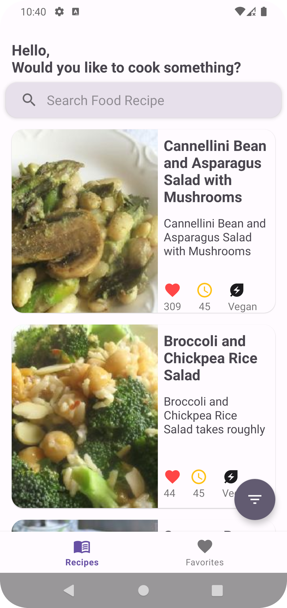
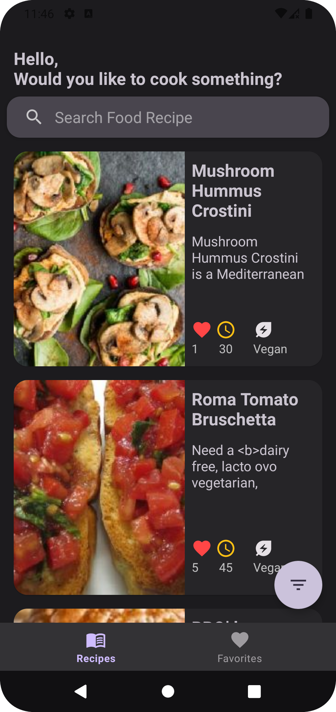
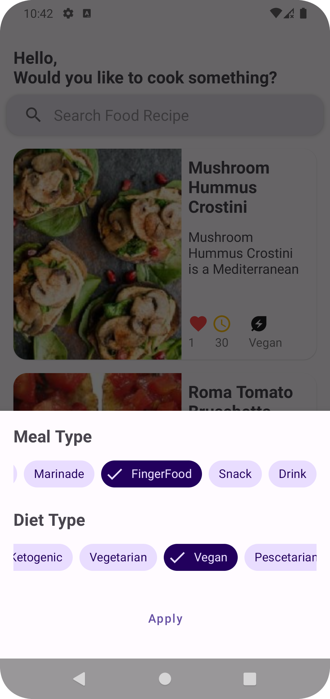
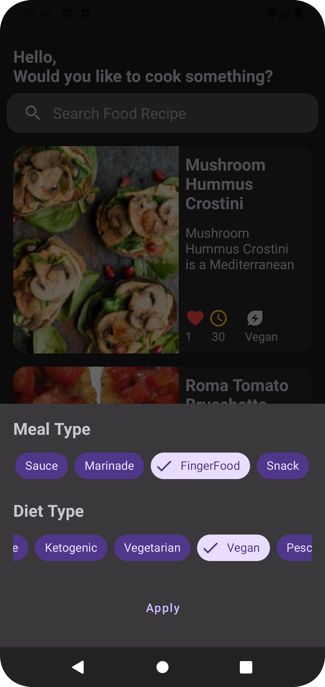
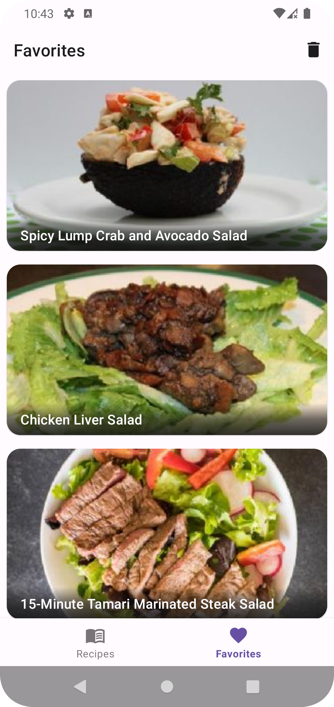
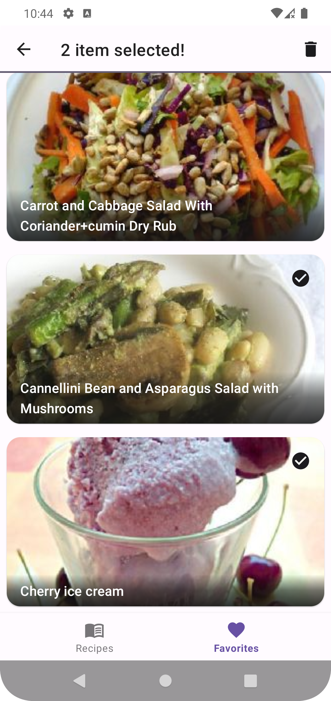
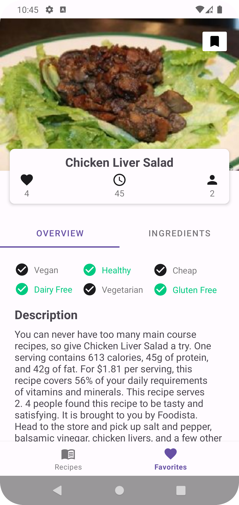
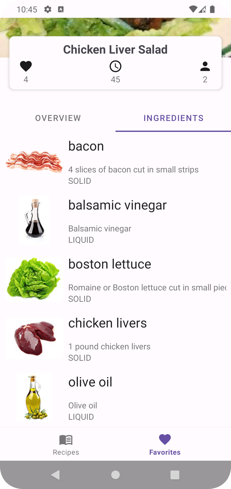
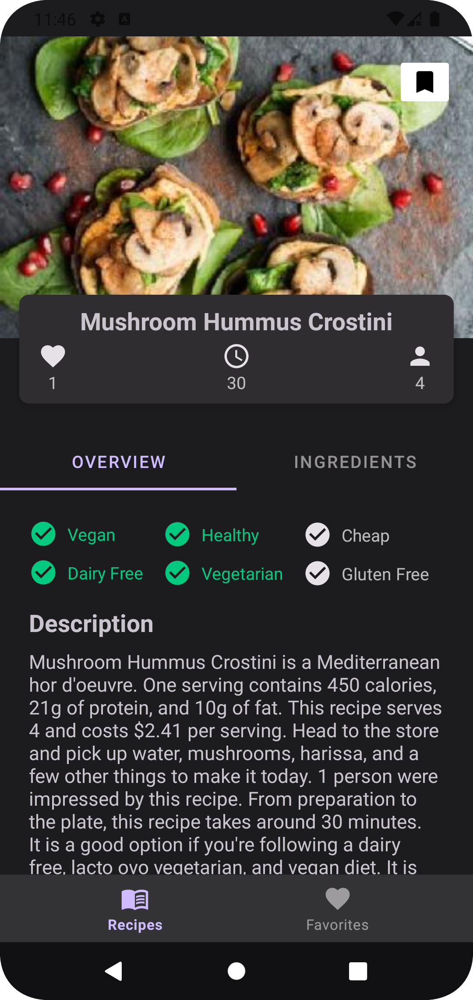

# food-recipe

| Home          | Dark Home             | 
| ------------- |:-------------:|
| </img>     |  </img> | 

| Filter Bottom Sheet             | Dark Filter Bottom Sheet        | 
| ------------- |:-------------:| 
| </img> | </img>       |

| Favorites          | with Contextual Action Mode          | Dark Favorites           | 
| ------------- | ------------- |:-------------:|
| </img>     | </img>     |  </img> |

| Detail - Overview          | Detail - Ingredients           |  Dark Detail | 
| ------------- |:-------------:|:-------------:|
| </img>     |  </img> |  </img>  |

| Detail - Overview          | 
| ------------- |
|  </img> |
